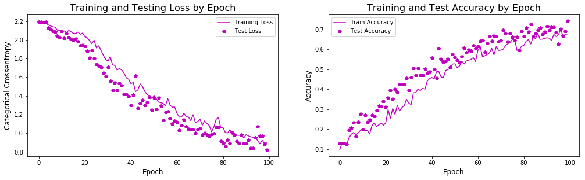
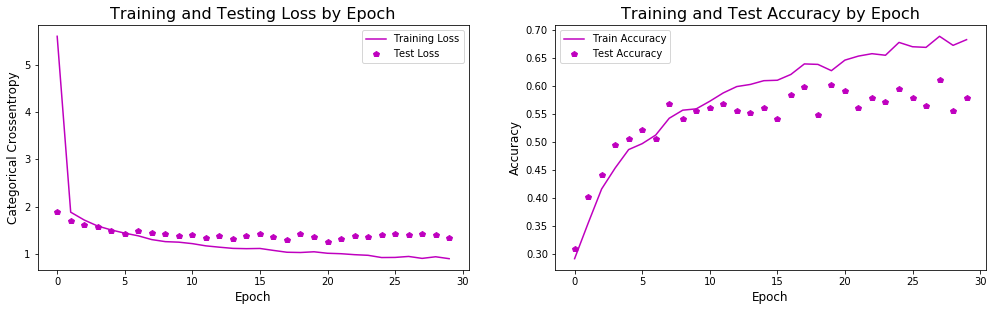

# Know Your AI: Developing a Framework to Address Bias in Facial Expression Recognition
## Training a Convolutional Neural Network (CNN) to Recognize Multicultural Facial Expressions

**Note:** Because of image rights for certain images, this repository can only be used for research purposes, and no images from this repository shall be reproduced elsewhere. Appropriate image credit is given where necessary. The image dataset used in this project cannot be shared in this repository because of specific image rights for the various image resources I used. However, if you want to run the notebooks in this repository, you can start with [2_CNN_Modeling](https://github.com/jasminevasandani/know-your-ai/blob/master/2_CNN_Modeling.ipynb). For more info on the images used to build my dataset, see [Sources](#Sources) section of this README.
 
## README Contents
 - [How to Navigate this Repository](#How-to-Navigate-this-Repository)
 - [Introduction](#Abstract)
 - [Methodology](#Methodology)
 - [CNN Modeling](#CNN-Modeling)
 - [Model Evaluation](#Model-Evaluation)
 - [Conclusions and Next Steps](#Conclusions-and-Next-Steps)
 - [Sources](#Sources)
 - [Acknowledgements](#Acknowledgements)

## How to Navigate this Repository
- [**data**](https://github.com/jasminevasandani/know-your-ai/tree/master/data): Contains image pixels csv file and model weights
- [**images**](https://github.com/jasminevasandani/know-your-ai/tree/master/images): Contains all data visualizations and other images that appear in this repository (except for the images used in my dataset)
- [**1_Image_Processing.ipynb**](https://github.com/jasminevasandani/know-your-ai/blob/master/1_Image_Processing.ipynb): A Jupyter Notebook written in python that pre-processes image files into a csv. If you have your own facial image dataset that you need to prep for modeling, start with this notebook.
- [**2_CNN_Modeling.ipynb**](https://github.com/jasminevasandani/know-your-ai/blob/master/2_CNN_Modeling.ipynb): A Jupyter Notebook written in python that develops three CNN models to predict facial expression. If you don't have an image dataset and want to use the one I created, start with this notebook.

## Introduction
I implement a framework to address bias in artificial intelligence (AI) through building a Convolutional Neural Network (CNN) to detect multicultural facial expressions. Bias in AI occurs for many reasons, but here are three primary factors that I will directly address in this project:

- **The Data**: How and what data is collected
- **The Person**: Who is collecting and analyzing the data
- **The Framework**: The frameworks used to analyze that data

It is not possible to mitigate bias in AI if there is no consideration of _at least_ these three factors. Here's how I attempt to mitigate bias in AI through addressing the three aforementioned factors:

- **The Data**: I made sure to include images people of color, gender non-conforming people, young and old people in the dataset that I would use to train my model.
- **The Person**: I am affected by and deeply concerned by bias in AI.
- **The Framework**: I'm building a CNN model to detect facial expressions from images of people's faces. Typically, the categories used to classify facial expressions are emotions like happy, sad, angry, surprised, and so on. But facial expressions are not the same for all cultures. For example, a wink here (whereever "here" is for you) may not mean the same thing somewhere else. To classify and predict facial expressions, I'm not just simply using a framework like happy, sad, angry, etc. Instead, I'm using a framework that pushes back against the notion that emotions are universal. For this project, I classify and understand emotions according to the "navarasa" (or, nine emotions).

**The Framework: Navarasa**
 
The navarasa were defined in the Sansrkit text, _Natya Shastra_ (200 BCE - 200 CE or 500 BCE - 500 CE) (1), written by Bharata Muni who was a South Asian theatrologist and musicologist. The _Natya Shastra_ is considered to be the foundational text for classical South Asian arts today. The _Natya Shastra_ coined the Sanskrit term _rasa_, which can be literally translated to mean  "sap" or "juice", but can also mean “essence,” “taste,” “flavor,” or "emotion" (2). In the text, Bharata states that the navarasa are "the basis of all human emotions" (3). The navarasa are: 
  - 1: 'adbhuta (astonishment)', 
  - 2: 'bibhatsa (disgust)', 
  - 3: 'bhayanaka (fear)', 
  - 4: 'hasya (joy)', 
  - 5: 'karuna (sorrow)', 
  - 6: 'roudra (anger)', 
  - 7: 'santa (peace)', 
  - 8: 'srngara (love)', 
  - 9: 'veera (confidence)'

There is so much more to explain about the navarasa, but I will leave at that for the sake of this project. With more time and resources, I hope to dive deeper into the concept of the navarasa and other cultural expressions to develop more nuanced AI frameworks. For now, this is enough to understand how the navarasa are used in this project. 

**Navarasa Sources**: 
- (1) https://en.wikipedia.org/wiki/Bharata_Muni
- (2) https://www.britannica.com/art/rasa
- (3) https://www.telegraphindia.com/opinion/powerful-feelings/cid/1448393

## Methodology 
To complete this project, I created a small, handpicked image dataset, pre-processed the images for modeling, trained my dataset on CNN models, and assessed my predictions. The model with the best fit augmented my image data, and the accuracy score was 69% compared to a baseline score of 12%. Considering the size and quality of my dataset, I am pleased with my results and can use this model as a starting point to train an even larger and better quality dataset. 

[Image source for "srngara" face](https://www.flickr.com/photos/tjook/4746803656/in/photolist-9XdG49-vcFh7S-62Lxcp-pZWg1t-ain93R-4pF4Tj-qVmc3t-nAdLsE-6AvFTU-eEBsvZ-oeP8XZ-8VQ7Mk-nSHdPx-Ji7CH-nQkN6k-8esBmm-bnJ5Xz-N3Wfum-WKbD95-q1eDgh-e7wfGD-iGsRxx-aHcyre-rBfkRk-az6phv-avEQh5-aipWsh-dNyWsX-XtizkB-jbhRuk-9rgG3b-nZ9ti4-YoYm6E-31Dnp-p4jisb-qouL-9JdMW-4pSazz-8NpcSZ-pHLuGS-8moqdb-dQGBn4-4BZ2ib-p4jivC-21X7AXj-9goFCZ-95nxEX-bo1c8t-bCumKj-q1eRpW)

| Data Science Workflow       | Description                                                                                                                                                                         |
|-----------------------------|-------------------------------------------------------------------------------------------------------------------------------------------------------------------------------------|
| **Problem Statement**            | Bias, racism, and sexism are built into AI. How might I address this problem? Goal: Implement a framework to address bias in artificial intelligence (AI) through building a Convolutional Neural Network (CNN) to detect multicultural facial expressions.                         |
| **Data Acquisition**   | Being mindful of image rights, I only selected public, opensource, and creative commons images. It was difficult to build a large dataset while maintaining balanced classes of _nine_ distinct emotions. In total I acquired 1,032 images. See image sources for more details. The distinctness of each emotion set of images could be improved with enough resources and time. |
| **Data Processing** | Find face in image, crop face to 75 x 110 pixels, convert to grayscale, and convert to numpy array.                                                                                                 |
| **Modeling**                    | Relying on Francois Chollet’s methodologies for deep learning in computer vision applications, I implemented three CNN models: one with the images as they are, the second implementing `ImageDataGenerator`, and the third using a pre-trained model (`VGG16`). |
| **Assessing Predictions**                    | I visualized the probability of predicting certain emotions for each image, a confusion matrix, and predicted versus actual results. |

## CNN Modeling
I implemented three CNN models that could predict facial expression. The most effective was model #2. Below is an example of what a CNN model's layers can look like. For an explanation on CNN modeling, see [2_CNN_Modeling notebook](https://github.com/jasminevasandani/know-your-ai/blob/master/2_CNN_Modeling.ipynb). 

 
  
**Model #1: CNN on original dataset of 1,032 images**
  - Test loss: 1.4
  - Test accuracy: 67%
  - Train/Test assessment: overfit 
  - Notes: Given the small dataset and quality of images, it’s no surprise that the model is overfit.

**Model #2: CNN on augmented data**
  - Test loss: 0.9
  - Test accuracy: 70% 
  - Train/Test assessment: fit
  - Notes: Image augmentation drastically corrected my model to make it more fit.

**Model #3: CNN on augmented data using `VGG16`**
  - Test loss: 1.3
  - Test accuracy: 62% 
  - Train/Test assessment: relatively fit
  - Notes: Despite being trained on `VGG16` (a CNN model pre-trained on ~1.4 million RGB, 224x224 images belonging to 1000 categories), the model did not perform better. This could be because the original model was trained on RGB images and non-facial expressions, while my dataset consisted of grayscale images exclusively of distinct facial expressions. Further testing needs to be done.

## Model Evaluation
The following image and probability comparisons show what the image and actual emotion is, compared to the predicted emotion is and the probabilities of each emotion that the CNN model detected on the face. You'll see that some images have a high probability of one or two emotions, while others have a wide ranging distribution of predicted emotions. **See [2_CNN_Modeling notebook](https://github.com/jasminevasandani/know-your-ai/blob/master/2_CNN_Modeling.ipynb) for more evaluation visualizations.** 
 
 

 
 

 
 

 
 

 
 
Below is a confusion matrix that shows true versus predicted emotions. The model tended to confuse the following emotions with each other: 
  - roudra (anger) and veera (confidence)
  - roudra (anger) and bibhatsa (disgust)
  - roudra (anger) and karuna (sorrow)

## Conclusions and Next Steps 
My main priorities while working on this project were to have a clear and strategic workflow for: 
 - addressing bias in AI
 - implenting a convolutional neural network 
 
My biggest challenge while working on this project was building a robust and good-quality dataset. My dataset consists of images all types of faces, including those of people of color, young and old people, and gender non-conforming people. It was difficult to meet my requirements while also building a large dataset and maintaining balanced classes for each emotion. In the end, my dataset was balanced, but the size was small and the distinctness between each emotion could be improved. Therefore, my dataset affected the performance of my models. Moving forward, I will attempt to build a larger and better-quality dataset. 

Additionally, I want to take advantage of more pre-trained neural networks. The one I used in this project, `VGG16`, was trained on a large variety of images that were RGB and 224 x 224. Moving forward, I will attempt to create a dataset where dimensions and color scheme match closely to a pre-trained network of my choosing. 

Overall, I am pleased with what I have achieved by completing this project, which include the following: 
 - Address bias in AI through having a: 
   - (1) diverse and inclusive dataset of images
   - (2) non-dominant framework for categorizing emotions 
   - (3) personal understanding of bias in AI through my own lived experiences
 - Make accessible to all a step-by-step guide for addressing bias in AI
 - Introduce new, critical ways for approaching a data science problem 
 - But also, introduce a first-step for many to think even deeper about addressing bias in AI 

## Sources 
**Images**
 
I hand-selected images from each of these sources. Keep in mind that many royalty-free stock photo resources do not include a wide variety of emotion expression images. The Kanade and Brazilian FEI databases do not allow me to republish or share the images from their databases. Therefore when running this notebook, you can only start by uploading the csv file containing pixel data. **Because of image rights for certain images, I cannot share my original image dataset. Appropriate image credit is given where necessary.**
  - [Vice’s Gender Spectrum Collection](https://broadlygenderphotos.vice.com)
  - [Flickr](https://www.flickr.com/) 
  - [Pexels](https://www.pexels.com/)
  - [Unsplash](https://unsplash.com/)
  - [Women of Color in Tech stock photos](https://www.flickr.com/photos/wocintechchat/) 
  - [Indian Movie Face Database](http://cvit.iiit.ac.in/projects/IMFDB/)
  - [Kanade, T., Cohn, J. F., & Tian, Y. (2000)](http://www.consortium.ri.cmu.edu/ckagree/)
  - [Brazilian FEI Face Database](https://fei.edu.br/~cet/facedatabase.html)

**Code References**
 
Deep Learning by Francois Chollet.

## Acknowledgements 
Thanks to the following people who guided and supported me as I completed this project: Anuva Kalawar, Adiwid (Boom) Devahastin Na Ayudhya, Matthew Brems, Riley Dallas, Tim Book.